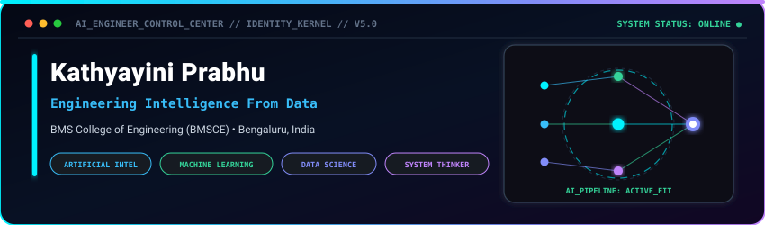
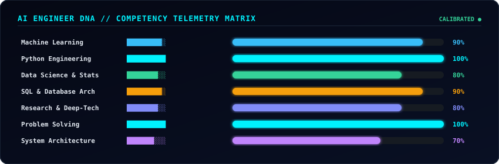
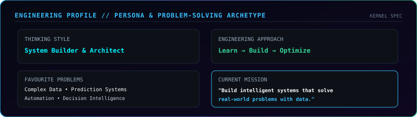
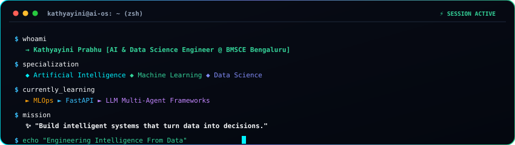
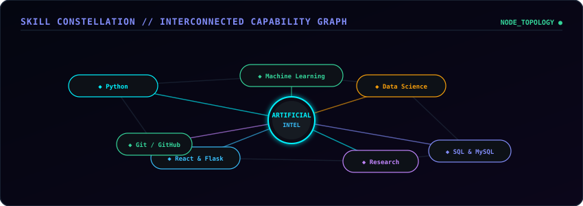
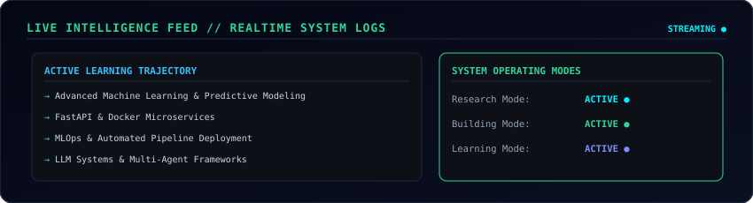
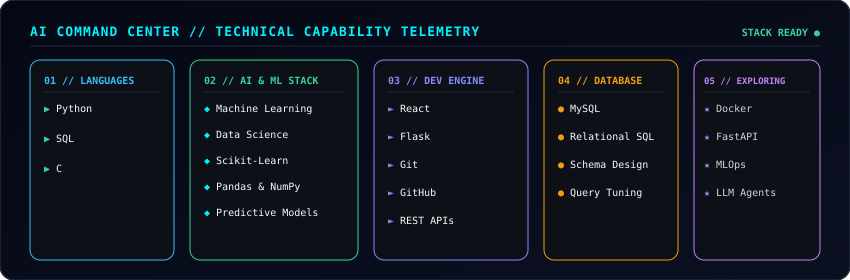
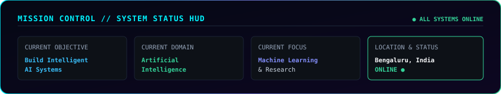

  

  

> **"Building intelligent systems that transform complex data into actionable decisions through Artificial Intelligence, Machine Learning, Data Science, and Software Engineering."**

  

## 🧬 AI Engineer DNA // Telemetry Matrix

  

  

## 🧠 Engineering Profile // Persona & Archetype

  

  

## 📟 Interactive AI Terminal

  

  

## 🌌 Skill Constellation // Capability Graph

  

  

## 📡 Live Intelligence Feed // Realtime System Logs

  

  

## 🎛️ AI Command Center // Technical Stack

  

  

## 🚀 Key Built Systems // Compact Matrix

<table>
  <tr>
    <td width="33%" valign="top">
      <h4>🧬 BioWeaver</h4>
      
<b>Computational Biology</b>

      
Knowledge graph intelligence for predicting gene-disease associations &amp; explainable research hypotheses.

      
<code>Python</code> <code>Flask</code> <code>React</code>

    </td>
    <td width="33%" valign="top">
      <h4>🚢 Maritime Risk AI</h4>
      
<b>Logistics Intelligence</b>

      
Predictive vessel route risk analysis, seasonal forecasting, and container port congestion optimization.

      
<code>Python</code> <code>Flask</code> <code>React</code>

    </td>
    <td width="33%" valign="top">
      <h4>🦯 SMARTCANE</h4>
      
<b>Assistive Technology</b>

      
Smart obstacle detection and navigation guidance system for visually impaired individuals.

      
<code>IoT</code> <code>Sensors</code> <code>Embedded</code>

    </td>
  </tr>
  <tr>
    <td width="50%" valign="top">
      <h4>🛣️ RoadWatch BIMSTEC</h4>
      
<b>Transportation Analytics</b>

      
Road infrastructure intelligence with automated hazard telemetry &amp; condition monitoring.

      
<code>Analytics</code> <code>GIS</code> <code>Python</code>

    </td>
    <td width="50%" valign="top">
      <h4>🎓 Smart Attendance &amp; Timetable</h4>
      
<b>EdTech Automation</b>

      
Automated constraint-satisfaction scheduling engine and digitized attendance management.

      
<code>Algorithms</code> <code>Automation</code> <code>Python</code>

    </td>
  </tr>
</table>

  

## 💡 Why I Build // Engineering Manifesto

<table>
  <tr>
    <td width="50%" valign="top">
      <h4>🔍 01 // Relentless Curiosity &amp; Research</h4>
      
Driven by deep questions in artificial intelligence and complex data systems, with a strong instinct to explore underlying mechanisms rather than treat algorithms as black boxes.

    </td>
    <td width="50%" valign="top">
      <h4>🛠️ 02 // System Thinking &amp; Architecture</h4>
      
Focusing on the complete lifecycle: from data modeling and robust SQL schema design to deployable, scalable machine learning microservices.

    </td>
  </tr>
  <tr>
    <td width="50%" valign="top">
      <h4>🎯 03 // Real-World Problem Solving</h4>
      
Committed to turning theoretical machine learning concepts into tangible software products that automate workflows and generate measurable impact.

    </td>
    <td width="50%" valign="top">
      <h4>📈 04 // Continuous Learning &amp; Agility</h4>
      
Consistently pushing technical boundaries across modern stacks — exploring MLOps, FastAPI, Docker, and multi-agent AI ecosystems.

    </td>
  </tr>
</table>

  

## 📊 Live GitHub Telemetry & Activity

  
  &nbsp;
  

  

  

## 🛰️ Mission Control // Live Telemetry

  

  
  &nbsp;&nbsp;
  
  &nbsp;&nbsp;
  

