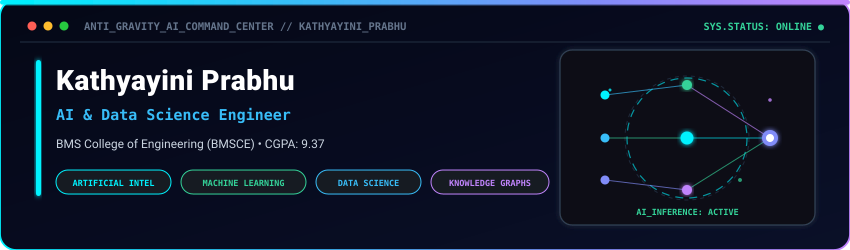
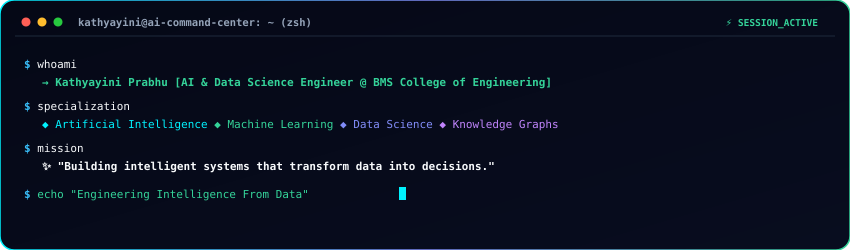
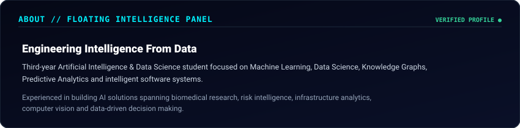
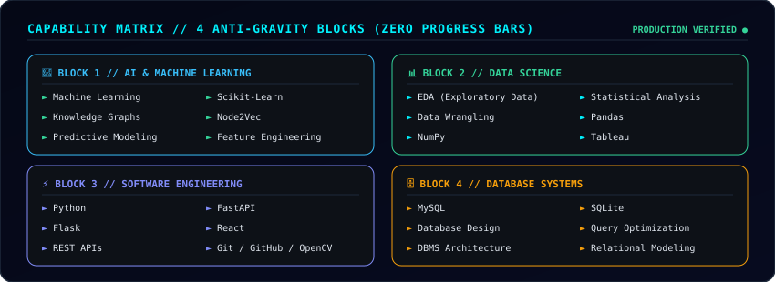
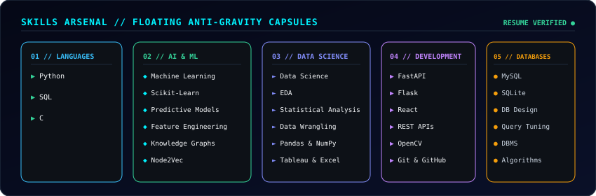
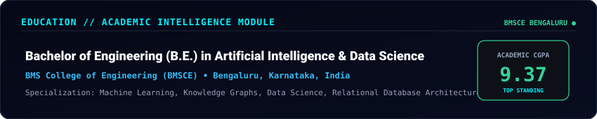
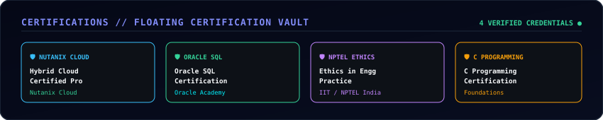
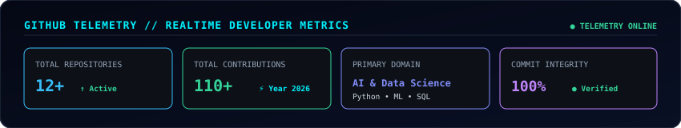

  

  

> **"Building intelligent systems that transform complex data into actionable decisions through Artificial Intelligence, Machine Learning, Data Science, and Software Engineering."**

  

## 📟 Interactive AI Terminal

  

  

## 🧠 About // Intelligence Overview

  

  

## 🎛️ Capability Matrix // 4 Anti-Gravity Blocks

  

  

## 🛠️ Skills Arsenal // Floating Technology Capsules

  

  

## 🚀 Holographic Project Pods

<table>
  <tr>
    <td width="50%" valign="top">
      <h3>🧬 01 // BioWeaver</h3>
      
<b>Biomedical AI &amp; Knowledge Graph Platform</b>

      
AI-powered biological discovery platform integrating multi-relational knowledge graphs to predict gene-disease associations and generate explainable research hypotheses.

      
<b>Stack:</b> <code>Python</code> <code>Flask</code> <code>React</code> <code>Knowledge Graphs</code> <code>Node2Vec</code> <code>Scikit-Learn</code>

      

        
      

    </td>
    <td width="50%" valign="top">
      <h3>🚢 02 // AI Maritime Risk Intelligence</h3>
      
<b>Predictive Supply Chain Risk Analytics</b>

      
Intelligent maritime analytics platform engineered for vessel route risk prediction, seasonal disruption forecasting, and container port congestion optimization.

      
<b>Stack:</b> <code>Python</code> <code>Flask</code> <code>React</code> <code>Predictive ML</code> <code>Pandas</code> <code>NumPy</code>

      

        
      

    </td>
  </tr>
  <tr>
    <td width="50%" valign="top">
      <h3>🎓 03 // Smart Attendance &amp; Timetable Generator</h3>
      
<b>Computer Vision + Scheduling Optimization</b>

      
Automated academic scheduling engine that solves multi-variable resource constraints to generate collision-free timetables paired with digitized attendance tracking.

      
<b>Stack:</b> <code>Python</code> <code>OpenCV</code> <code>Algorithms</code> <code>Constraint Solver</code> <code>Flask</code>

      

        
      

    </td>
    <td width="50%" valign="top">
      <h3>🛣️ 04 // RoadWatch</h3>
      
<b>Infrastructure Risk Intelligence Platform</b>

      
Regional road quality and infrastructure intelligence platform featuring automated road-hazard telemetry, geospatial condition mapping, and traffic analytics.

      
<b>Stack:</b> <code>Python</code> <code>GIS Analytics</code> <code>Data Science</code> <code>Pandas</code> <code>REST APIs</code>

      

        
      

    </td>
  </tr>
  <tr>
    <td colspan="2" valign="top">
      <h3>🦯 05 // SmartCane</h3>
      
<b>Assistive IoT Navigation Device</b>

      
Smart navigation and obstacle detection system designed to empower visually impaired individuals through intelligent multi-sensor spatial guidance and real-time haptic alerts.

      
<b>Stack:</b> <code>C</code> <code>IoT Sensors</code> <code>Embedded Systems</code> <code>Hardware Prototyping</code>

      

        
      

    </td>
  </tr>
</table>

  

## 🎓 Academic Intelligence Module

  

  

## 🛡️ Floating Certification Vault

  

  

## 📊 Live GitHub Telemetry & Activity

  

  

  

## 🛰️ Mission Control

  

  
  &nbsp;&nbsp;
  
  &nbsp;&nbsp;
  

