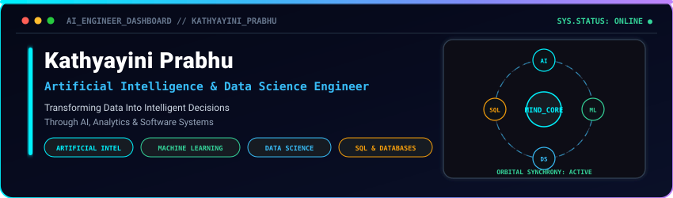
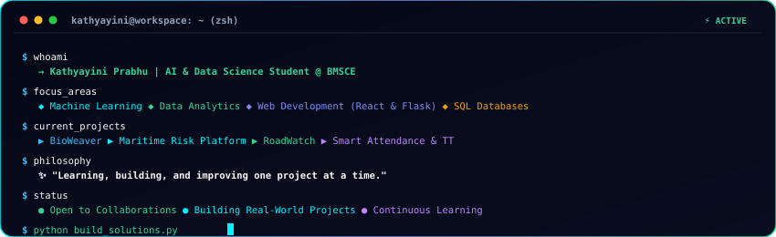
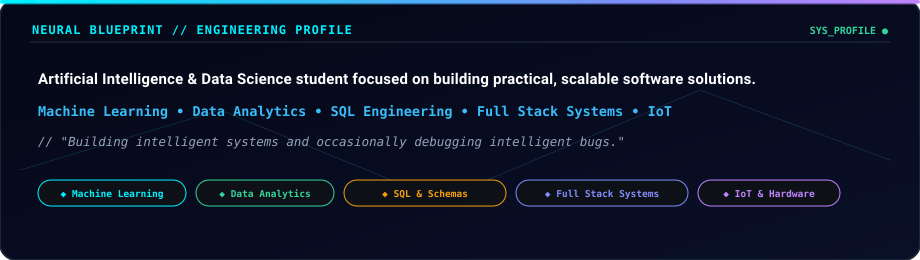
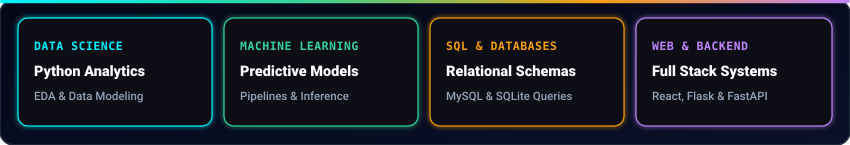
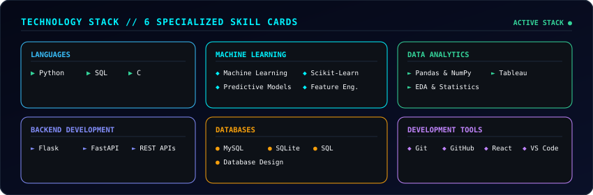
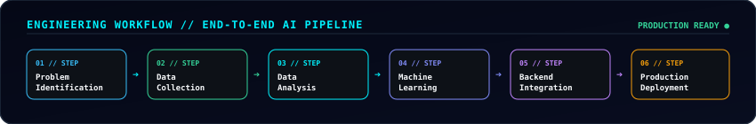
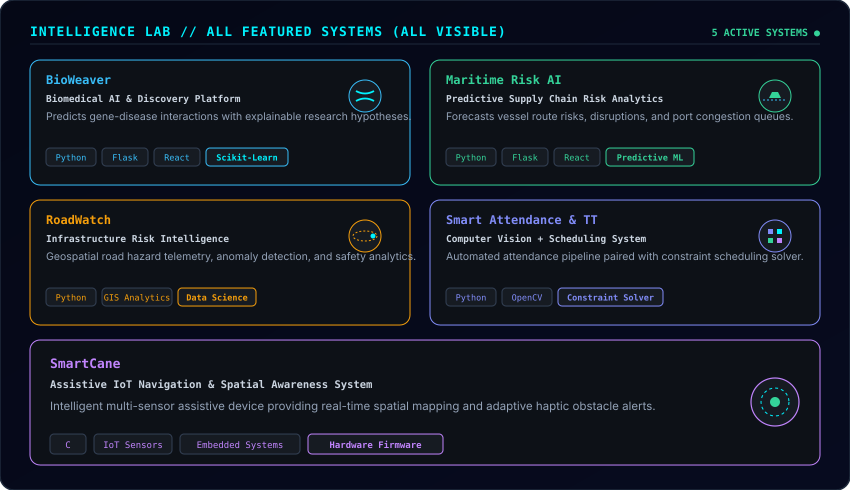

  

  

> **"Designing and developing intelligent software systems that leverage Artificial Intelligence, Data Science, Machine Learning, and Database Engineering to solve real-world challenges and drive data-driven decision making."**

  

## Interactive Terminal

  

  

## Neural Blueprint

  

  

## Neural Capability Matrix

  

  

## Technology Stack

  

  

## Engineering Workflow

  

  

## Intelligence Lab

  

<table>
  <tr>
    <td width="50%" valign="top">
      <h3>01 // BioWeaver</h3>
      
<b>Biomedical AI &amp; Discovery Platform</b>

      
Predicts gene-disease interactions with explainable research hypotheses.

      
<b>Stack:</b> <code>Python</code> <code>Flask</code> <code>React</code> <code>Scikit-Learn</code>

      

        
      

    </td>
    <td width="50%" valign="top">
      <h3>02 // Maritime Risk AI</h3>
      
<b>Predictive Supply Chain Risk Analytics</b>

      
Forecasts vessel route risks, disruptions, and port congestion queues.

      
<b>Stack:</b> <code>Python</code> <code>Flask</code> <code>React</code> <code>Predictive ML</code>

      

        
      

    </td>
  </tr>
  <tr>
    <td width="50%" valign="top">
      <h3>03 // RoadWatch</h3>
      
<b>Infrastructure Risk Intelligence</b>

      
Geospatial road hazard telemetry, anomaly detection, and safety analytics.

      
<b>Stack:</b> <code>Python</code> <code>GIS Analytics</code> <code>Data Science</code> <code>Pandas</code>

      

        
      

    </td>
    <td width="50%" valign="top">
      <h3>04 // Smart Attendance &amp; TT</h3>
      
<b>Computer Vision + Scheduling System</b>

      
Automated attendance pipeline paired with constraint scheduling solver.

      
<b>Stack:</b> <code>Python</code> <code>OpenCV</code> <code>Constraint Solver</code> <code>Flask</code>

      

        
      

    </td>
  </tr>
  <tr>
    <td colspan="2" valign="top">
      <h3>05 // SmartCane</h3>
      
<b>Assistive IoT Navigation &amp; Spatial Awareness System</b>

      
Intelligent multi-sensor assistive device providing real-time spatial mapping and adaptive haptic obstacle alerts.

      
<b>Stack:</b> <code>C</code> <code>IoT Sensors</code> <code>Embedded Systems</code> <code>Firmware</code>

      

        
      

    </td>
  </tr>
</table>

  

## Contribution Activity

  

  

## Mission Control

  

  
  &nbsp;&nbsp;
  
  &nbsp;&nbsp;
  

