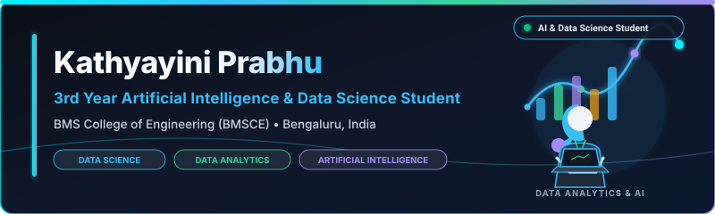
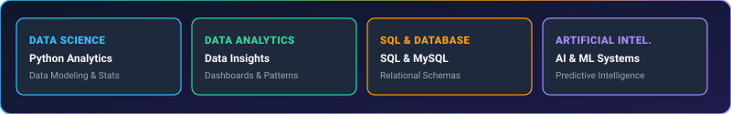
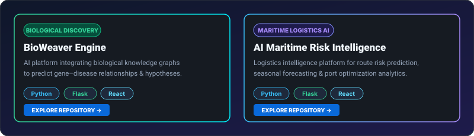

  

  

> **Kathyayini Prabhu | 3rd Year AI & Data Science Student @ BMSCE | Building practical software solutions through Artificial Intelligence, Data Science, Data Analytics, SQL, and continuous learning.**

  

---

### About Me

I'm a 3rd Year Artificial Intelligence & Data Science student at **BMS College of Engineering (BMSCE)**, Bengaluru.

I enjoy building practical software solutions, analyzing datasets, working with relational database architectures, and continuously improving my development and problem-solving skills. My interests span artificial intelligence, data science, data analytics, SQL database design, and machine learning, with a focus on creating impactful real-world projects.

  

### Education

* **B.E. in Artificial Intelligence & Data Science**  
  **BMS College of Engineering (BMSCE)** — Bengaluru, Karnataka, India  
  *(3rd Year Undergraduate)*

  

### Current Focus

- **Data Science & Data Analytics** — Extracting actionable insights from structured & unstructured datasets
- **Artificial Intelligence & ML** — Developing intelligent systems and predictive algorithms for domain challenges
- **SQL & Database Architecture** — Designing relational database schemas and optimizing complex SQL queries
- **Software Engineering** — Building clean, reliable applications with Python & C
- **Building Real-World Projects** — Transforming concepts into robust software solutions

---

### Currently Learning

- **Advanced Data Science & Analytics** — Creating clean data stories, dashboards & statistical modeling
- **Advanced Artificial Intelligence & ML** — Feature engineering, algorithm tuning & model evaluation
- **Relational Databases & SQL** — Advanced SQL querying, indexing, and data modeling
- **Advanced Python Development** — Object-oriented architecture, async execution & clean code practices

  

### Technical Skills

#### **Languages**

  
  &nbsp;
  
  &nbsp;
  

#### **Frameworks & Tools**

  
  &nbsp;
  
  &nbsp;
  
  &nbsp;
  
  &nbsp;
  

  

### Featured Projects

  

  
  &nbsp;&nbsp;&nbsp;&nbsp;
  

  

### Connect With Me

  
  &nbsp;&nbsp;
  
  &nbsp;&nbsp;
  

