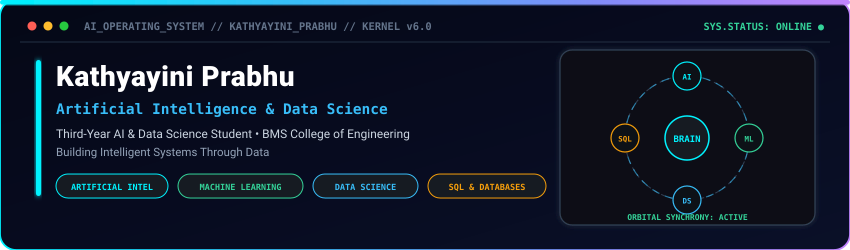
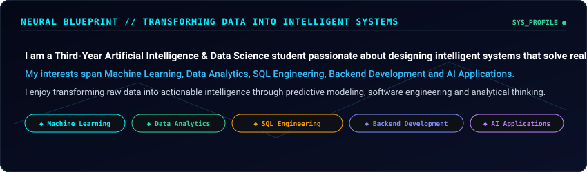
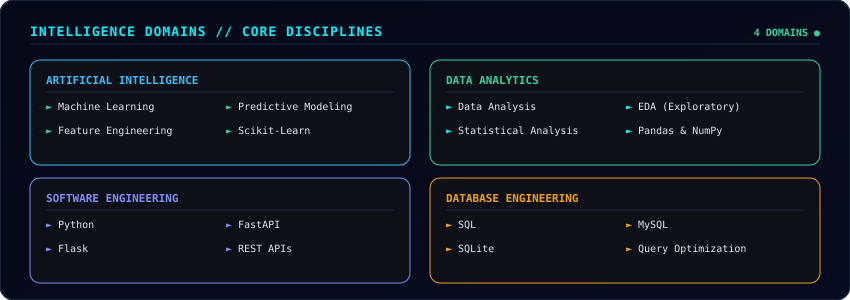
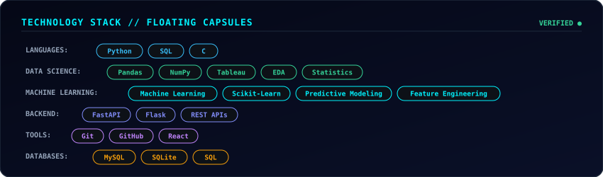
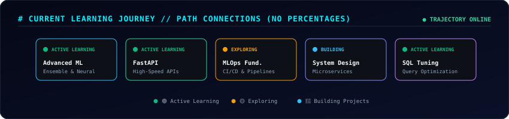
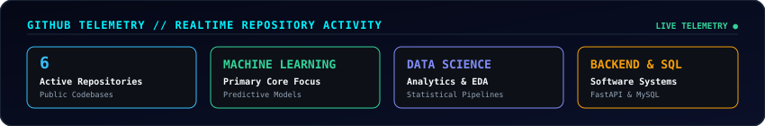

  

  

> **"Transforming Data Into Intelligent Decisions through Machine Learning, Data Analytics, SQL Engineering, and Software Systems."**

  

## Interactive Terminal

  

  

## Neural Blueprint

  

  

## Intelligence Domains

  

  

## Technology Stack

  

  

## Intelligence Lab

  

  

  

## Current Learning Journey

  

  

## GitHub Telemetry

  

  

  

## Mission Control

  

  
  &nbsp;&nbsp;
  
  &nbsp;&nbsp;
  

