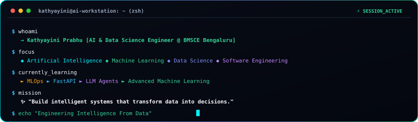
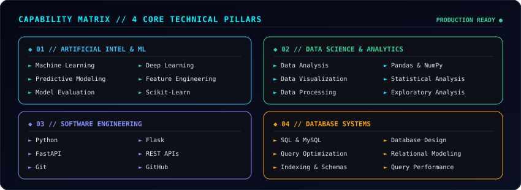
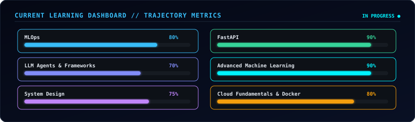
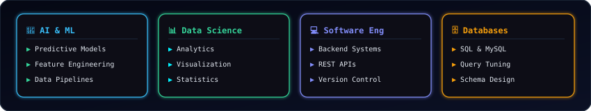

  

  

> **"Building intelligent systems that transform complex data into actionable decisions through Artificial Intelligence, Machine Learning, Data Science, and Software Engineering."**

  

## 📟 Interactive AI Terminal

  

  

## 🎛️ Capability Matrix // 4 Core Technical Pillars

  

  

## 📈 Current Learning Dashboard // Active Trajectory

  

  

## 🧠 Engineering Stats & Focus Areas

  

  

## 🛠️ Skills Arsenal

#### **Core Languages**

  
  &nbsp;
  
  &nbsp;
  

#### **AI & Data Science**

  
  &nbsp;
  
  &nbsp;
  
  &nbsp;
  
  &nbsp;
  

#### **Development & Backend**

  
  &nbsp;
  
  &nbsp;
  
  &nbsp;
  
  &nbsp;
  

#### **Databases & Query Optimization**

  
  &nbsp;
  
  &nbsp;
  

  

## 📊 Live GitHub Telemetry & Activity

  

  

  

## 🚀 Key Built Systems // Compact Showcase

<table>
  <tr>
    <td width="50%" valign="top">
      <h4>🧬 BioWeaver</h4>
      
AI-powered biological discovery platform integrating multi-relational knowledge graphs for gene-disease prediction and explainable hypothesis generation.

      
<b>Stack:</b> <code>Python</code> <code>Flask</code> <code>React</code> <code>Knowledge Graphs</code>

      
<a href="https://github.com/Kathyayini26/bioweaver" target="_blank"><b>&#9654; View Repository</b></a>

    </td>
    <td width="50%" valign="top">
      <h4>🚢 AI Maritime Risk Intelligence</h4>
      
Intelligent maritime analytics platform for predictive vessel route risk analysis, seasonal forecasting, and container port congestion optimization.

      
<b>Stack:</b> <code>Python</code> <code>Flask</code> <code>React</code> <code>Predictive ML</code>

      
<a href="https://github.com/Kathyayini26" target="_blank"><b>&#9654; View Repository</b></a>

    </td>
  </tr>
  <tr>
    <td width="50%" valign="top">
      <h4>🦯 SMARTCANE</h4>
      
Smart navigation system assisting visually impaired individuals through intelligent multi-sensor spatial guidance and real-time haptic alerts.

      
<b>Stack:</b> <code>IoT</code> <code>Sensors</code> <code>C</code>

      
<a href="https://github.com/Kathyayini26" target="_blank"><b>&#9654; View Repository</b></a>

    </td>
    <td width="50%" valign="top">
      <h4>🎓 Smart Attendance &amp; Timetable Generator</h4>
      
Automated scheduling engine solving multi-variable resource constraints to generate collision-free timetables and digitized attendance.

      
<b>Stack:</b> <code>Python</code> <code>Algorithms</code> <code>Automation</code>

      
<a href="https://github.com/Kathyayini26" target="_blank"><b>&#9654; View Repository</b></a>

    </td>
  </tr>
  <tr>
    <td colspan="2" valign="top">
      <h4>🛣️ RoadWatch BIMSTEC</h4>
      
Road and infrastructure intelligence platform featuring automated road-hazard telemetry, geospatial condition mapping, and traffic analytics.

      
<b>Stack:</b> <code>Python</code> <code>Analytics</code> <code>GIS</code>

      
<a href="https://github.com/Kathyayini26" target="_blank"><b>&#9654; View Repository</b></a>

    </td>
  </tr>
</table>

  

## ⚡ Recruiter Highlights // Engineering Capabilities

<table>
  <tr>
    <td width="50%" valign="top">
      <h4>⚡ 01 // AI &amp; Data Science Focus</h4>
      
Dedicated technical specialization in developing predictive machine learning models, statistical analyses, and data transformation pipelines.

    </td>
    <td width="50%" valign="top">
      <h4>⚡ 02 // Strong Python &amp; SQL Foundation</h4>
      
Deep proficiency in writing modular, object-oriented Python software paired with complex SQL schema design and query optimization.

    </td>
  </tr>
  <tr>
    <td width="50%" valign="top">
      <h4>⚡ 03 // Backend Development Experience</h4>
      
Hands-on experience architecting scalable REST APIs and microservices using Flask and FastAPI to serve intelligent model inferences.

    </td>
    <td width="50%" valign="top">
      <h4>⚡ 04 // Research &amp; Continuous Learning</h4>
      
Active exploration of deep-tech domains including computational biology, knowledge graphs, MLOps pipelines, and LLM multi-agent systems.

    </td>
  </tr>
  <tr>
    <td width="50%" valign="top">
      <h4>⚡ 05 // Real-World Problem Solving</h4>
      
Translating theoretical concepts into functional software applications with clean architecture, robust testing, and measurable outcomes.

    </td>
    <td width="50%" valign="top">
      <h4>⚡ 06 // Active GitHub Contributor</h4>
      
Committed builder with structured Git version control practices, clear documentation, and consistent development activity.

    </td>
  </tr>
</table>

  

## 🛰️ Mission Control

  

  
  &nbsp;&nbsp;
  
  &nbsp;&nbsp;
  

