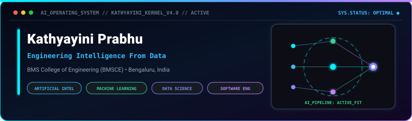
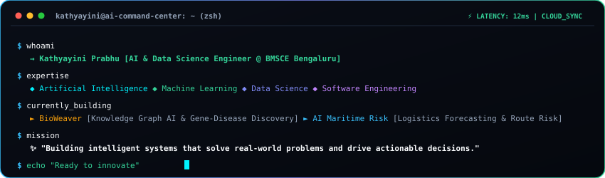
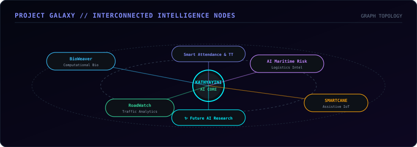
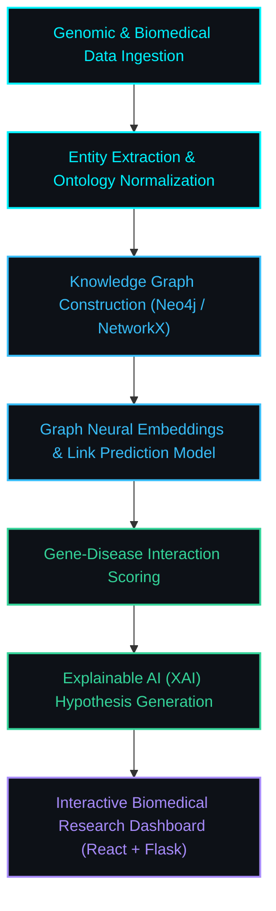
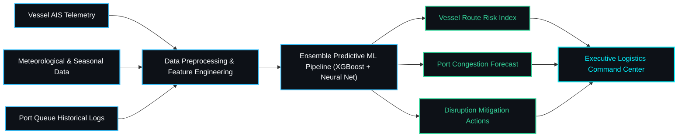
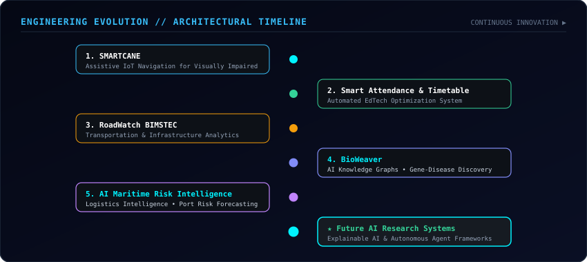
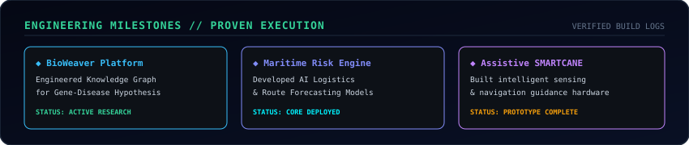
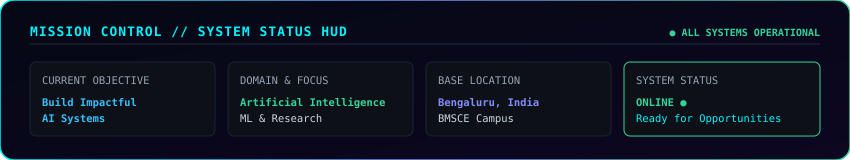

  

  

> **"Building intelligent systems that transform complex information into actionable decisions through Artificial Intelligence, Machine Learning, Data Science, and Software Engineering."**

  

## 📟 Interactive AI Terminal

  

  

## 🌌 Project Galaxy // Connected Intelligence Nodes

  

  

## 🚀 Featured AI & Software Projects

<table>
  <tr>
    <td width="50%" valign="top">
      <h3>🧬 01 // BioWeaver</h3>
      
<b>Category:</b> <code>Computational Biology</code> &nbsp;|&nbsp; <b>Status:</b> <code>Active Research &amp; Dev</code>

      
AI-powered biological discovery platform integrating multi-relational knowledge graphs to predict gene-disease associations and generate explainable biomedical research hypotheses.

      <ul>
        <li><b>Knowledge Graph Intelligence:</b> Multi-relational graph embedding pipelines</li>
        <li><b>Gene-Disease Prediction:</b> Link prediction across biological ontology entities</li>
        <li><b>Explainable AI (XAI):</b> Traceable reasoning paths for researchers</li>
      </ul>
      
<b>Stack:</b> <code>Python</code> <code>Flask</code> <code>React</code> <code>Knowledge Graphs</code>

      

        
      

    </td>
    <td width="50%" valign="top">
      <h3>🚢 02 // AI Maritime Risk Intelligence</h3>
      
<b>Category:</b> <code>Logistics Intelligence</code> &nbsp;|&nbsp; <b>Status:</b> <code>Active Development</code>

      
Intelligent maritime analytics platform engineered for vessel route risk prediction, seasonal disruption forecasting, and container port congestion optimization.

      <ul>
        <li><b>Route Risk Analysis:</b> Predictive threat &amp; weather pattern modeling</li>
        <li><b>Seasonal Forecasting:</b> Multi-variable time-series logistics forecasts</li>
        <li><b>Port Congestion Optimization:</b> Real-time vessel queue algorithms</li>
      </ul>
      
<b>Stack:</b> <code>Python</code> <code>Flask</code> <code>React</code> <code>Predictive ML</code>

      

        
      

    </td>
  </tr>
  <tr>
    <td width="50%" valign="top">
      <h3>🦯 03 // SMARTCANE</h3>
      
<b>Category:</b> <code>Assistive Technology &amp; IoT</code>

      
Smart navigation and obstacle detection system designed to empower visually impaired individuals through intelligent multi-sensor spatial guidance and real-time haptic alerts.

      
<b>Highlights:</b> Ultrasonic spatial mapping, adaptive tactile feedback, emergency telemetry.

    </td>
    <td width="50%" valign="top">
      <h3>🎓 04 // Smart Attendance &amp; Timetable Generator</h3>
      
<b>Category:</b> <code>Education Technology &amp; Automation</code>

      
Automated scheduling engine that solves multi-variable resource constraints to generate collision-free academic timetables paired with digitized attendance tracking.

      
<b>Highlights:</b> Constraint satisfaction solver, algorithmic optimization, automated reporting.

    </td>
  </tr>
  <tr>
    <td colspan="2" valign="top">
      <h3>🛣️ 05 // RoadWatch BIMSTEC</h3>
      
<b>Category:</b> <code>Transportation Analytics &amp; Infrastructure Monitoring</code>

      
Regional road quality and infrastructure intelligence platform featuring automated road-hazard telemetry, geospatial condition mapping, and traffic flow monitoring.

      
<b>Highlights:</b> Geospatial data analytics, road anomaly classification, municipal decision dashboards.

    </td>
  </tr>
</table>

  

## ⚙️ System Architectures

### 1. BioWeaver Knowledge Graph Discovery Workflow

### 2. AI Maritime Risk Intelligence Predictive Pipeline

  

## 🧭 Engineering Evolution

  

  

## 🎛️ AI Command Center // Technical Capabilities

  

  

## 🏆 Engineering Milestones & Proven Execution

  

  

## 📊 Live GitHub Telemetry & Activity

  
  &nbsp;
  

  

  

## 💼 Why Work With Me // Recruiter Brief

<table>
  <tr>
    <td width="50%" valign="top">
      <h4>⚡ 01 // Systems Builder Mindset</h4>
      
I don't just study theoretical algorithms — I architect, code, and deploy end-to-end intelligent applications that solve real-world problems from data ingestion to user interaction.

    </td>
    <td width="50%" valign="top">
      <h4>🎯 02 // Engineering Intelligence From Data</h4>
      
Strong foundation in structured SQL database design, predictive machine learning pipelines, and feature engineering to turn noisy data into reliable predictions.

    </td>
  </tr>
  <tr>
    <td width="50%" valign="top">
      <h4>🔬 03 // Research &amp; Deep-Tech Curiosity</h4>
      
Actively exploring computational biology, graph intelligence, and predictive modeling — eager to tackle challenging domain problems with explainable AI.

    </td>
    <td width="50%" valign="top">
      <h4>🤝 04 // Execution &amp; Continuous Growth</h4>
      
Disciplined builder with a high curiosity quotient, strong problem-solving skills, and the agility to adapt rapidly to modern engineering stacks.

    </td>
  </tr>
</table>

  

## 🛰️ Mission Control // Live Telemetry

  

  
  &nbsp;&nbsp;
  
  &nbsp;&nbsp;
  

