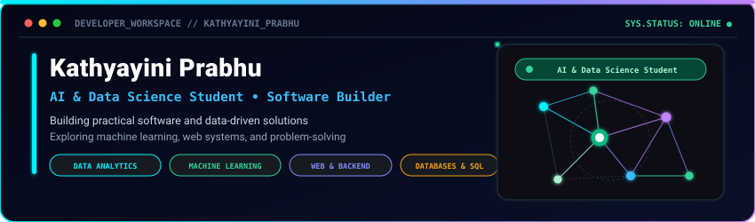
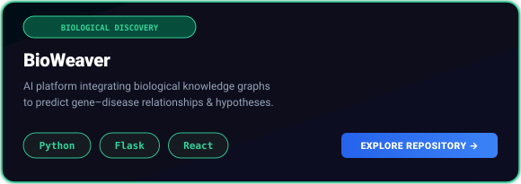
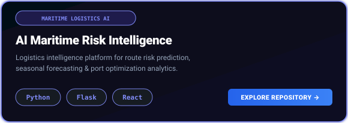
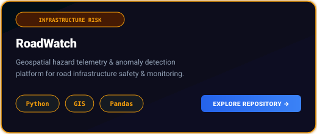
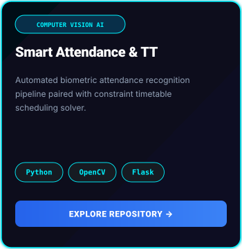
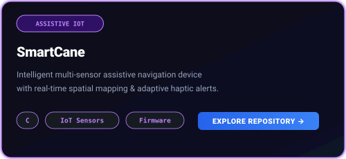

  

  

> **"Building practical software and data-driven solutions, with a focus on machine learning, web systems, and problem-solving through real-world engineering."**

  

  

## Interactive Terminal

  

  

## Neural Blueprint

  

  

## Technical Skills

### Languages

  
  &nbsp;
  
  &nbsp;
  

### Frameworks & Web

  
  &nbsp;
  
  &nbsp;
  
  &nbsp;
  

### Data Science & Machine Learning

  
  &nbsp;
  
  &nbsp;
  
  &nbsp;
  

### Databases

  
  &nbsp;
  

### Tools & Platforms

  
  &nbsp;
  
  &nbsp;
  

## Featured Projects

<table>
  <tr>
    <td width="33.33%" valign="top">
      
    </td>
    <td width="33.33%" valign="top">
      
    </td>
    <td width="33.33%" valign="top">
      
    </td>
  </tr>
  <tr>
    <td width="33.33%" valign="top">
      
    </td>
    <td width="33.33%" valign="top">
      
    </td>
    <td width="33.33%" valign="top">
    </td>
  </tr>
</table>

  

## Contribution Activity

  

  

## Mission Control

  

  
  &nbsp;&nbsp;
  
  &nbsp;&nbsp;
  

