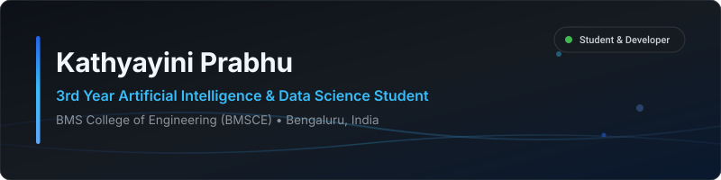
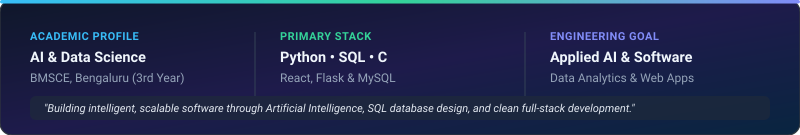
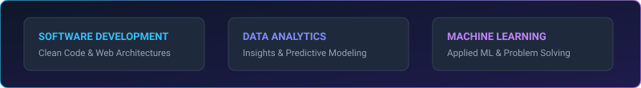

  

  

> **Kathyayini Prabhu | 3rd Year AI & Data Science Student | Building practical software solutions through Artificial Intelligence, SQL database design, data analytics, and continuous learning.**

  

  

---

### About Me

I'm a 3rd Year Artificial Intelligence & Data Science student at **BMS College of Engineering (BMSCE)**, Bengaluru.

I enjoy building practical software solutions, working with relational database architectures, exploring data-driven technologies, and continuously improving my development and problem-solving skills. My interests span software development, artificial intelligence, data analytics, SQL database design, and machine learning, with a focus on creating impactful real-world projects.

  

### Education

* **B.E. in Artificial Intelligence & Data Science**  
  **BMS College of Engineering (BMSCE)** — Bengaluru, Karnataka, India  
  *(3rd Year Undergraduate)*

  

### Current Focus

- **Artificial Intelligence & ML** — Developing intelligent systems and predictive algorithms for real-world domain challenges
- **SQL & Database Architecture** — Designing relational database schemas and optimizing complex SQL queries
- **Data Analytics** — Extracting actionable insights from structured datasets
- **Full Stack Development** — Building responsive web applications with React, Flask & Python
- **Building Real-World Projects** — Transforming concepts into robust software solutions

---

### Currently Learning

- **Advanced Artificial Intelligence & ML** — Practical feature engineering, algorithm tuning & model evaluation
- **Relational Databases & SQL** — Advanced SQL querying, indexing, and data modeling
- **Advanced Python Development** — Object-oriented architecture, async execution & clean code practices
- **Modern Web Development** — Component-driven frontend architecture & RESTful API design

  

### Technical Skills

#### **Languages**

  
  &nbsp;
  
  &nbsp;
  

#### **Frameworks & Tools**

  
  &nbsp;
  
  &nbsp;
  
  &nbsp;
  
  &nbsp;
  

  

### Featured Projects

<table>
  <tr>
    <td width="50%" valign="top">
      <h3 align="center">BioWeaver</h3>
      
AI-powered biological discovery platform that integrates biological knowledge graphs, predicts gene–disease relationships, and generates explainable research hypotheses.

      
<b>Technologies:</b> 
        
        
        
      

      

        
      

    </td>
    <td width="50%" valign="top">
      <h3 align="center">AI Maritime Risk Intelligence</h3>
      
AI-powered maritime logistics intelligence platform for route risk prediction, seasonal forecasting, alternative port optimization, and interactive mapping.

      
<b>Technologies:</b> 
        
        
        
      

      

        
      

    </td>
  </tr>
</table>

  

### Connect With Me

  
  &nbsp;&nbsp;
  
  &nbsp;&nbsp;
  

